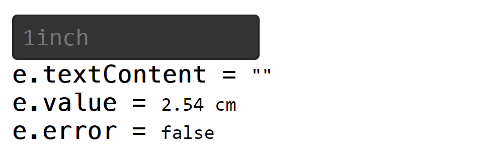

<h1> cluster-ui</h1>

### cluster-ui-input


This component is made to support user mathematical expressions. It bases its compilation of the expressions on the library math.js.
<a href='http://mathjs.org'>http://mathjs.org</a>

The element has the tag "cluster-input" and that class is inherited from the constructor `Ui.Component`.

**In HTML:**

```HTML
<cluster-input type='length' unit='cm' default='1inch'></cluster-input>
```

**In JavaScript:**

```Javascript
var input = new Cluster.Ui.Input('number');
// or
var input = document.createElement('cluster-input');

input.type = 'length';
input.unit = 'cm';
input.default = '1inch';

```

Here's what it would look like with this code:



***As you can see the value of the getter `value` is always expressed in centimeters, it is related to the fact that you have defined the value of `input.unit` to `"cm"`***

It supports several attributes:
- `contenteditable` : disable or enable the component
- `type` : indicates the type of expected measure*
- `unit` : indicates the unit expected. If false, the value returned is that of the unit entered by the user.
Otherwise the unit returned will be the one specified, the result will be calculated using the unit conversion function of the library math.js
- `default` : Specify a value to use if the field is empty.

*List of types:


<table>
  <thead>
    <tr>
      <th>Type code</th>
      <th>Units</th>
    </tr>
  </thead>
  <tbody>
    <tr>
      <td>length</td>
      <td>meter (m), inch (in), foot (ft), yard (yd), mile (mi), link (li), rod (rd), chain (ch), angstrom, mil</td>
    </tr>
    <tr>
      <td>surface</td>
      <td>m2, sqin, sqft, sqyd, sqmi, sqrd, sqch, sqmil, acre, hectare</td>
    </tr>
    <tr>
      <td>volume</td>
      <td>m3, litre (l, L, lt, liter), cc, cuin, cuft, cuyd, teaspoon, tablespoon, minim (min), fluiddram (fldr), fluidounce (floz), gill (gi), cup (cp), pint (pt), quart (qt), gallon (gal), beerbarrel (bbl), oilbarrel (obl), hogshead, drop (gtt)</td>
    </tr>
    <tr>
      <td>angle</td>
      <td>rad (radian), deg (degree), grad (gradian), cycle, arcsec (arcsecond), arcmin (arcminute)</td>
    </tr>
    <tr>
      <td>time</td>
      <td>second (s, secs, seconds), minute (mins, minutes), hour (h, hr, hrs, hours), day (days), week (weeks), month (months), year (years), decade (decades), century (centuries), millennium (millennia)</td>
    </tr>
    <tr>
      <td>frequency</td>
      <td>hertz (Hz)</td>
    </tr>
    <tr>
      <td>mass</td>
      <td>gram(g), tonne, ton, grain (gr), dram (dr), ounce (oz), poundmass (lbm, lb, lbs), hundredweight (cwt), stick, stone</td>
    </tr>
    <tr>
      <td>current</td>
      <td>ampere (A)</td>
    </tr>
    <tr>
      <td>temperature</td>
      <td>kelvin (K), celsius (degC), fahrenheit (degF), rankine (degR)</td>
    </tr>
    <tr>
      <td>amount_of_substance</td>
      <td>mole (mol)</td>
    </tr>
    <tr>
      <td>luminous_intensity</td>
      <td>candela (cd)</td>
    </tr>
    <tr>
      <td>force</td>
      <td>newton (N), dyne (dyn), poundforce (lbf), kip</td>
    </tr>
    <tr>
      <td>energy</td>
      <td>joule (J), erg, Wh, BTU, electronvolt (eV)</td>
    </tr>
    <tr>
      <td>power</td>
      <td>watt (W), hp</td>
    </tr>
    <tr>
      <td>pressure</td>
      <td>Pa, psi, atm, torr, bar, mmHg, mmH2O, cmH2O</td>
    </tr>
    <tr>
      <td>electric_charge</td>
      <td>ampere (A), coulomb (C), watt (W), volt (V), ohm, farad (F), weber (Wb), tesla (T), henry (H), siemens (S), electronvolt (eV)</td>
    </tr>
    <tr>
      <td>bit</td>
      <td>bit (b), byte (B)</td>
    </tr>
  </tbody>
</table>
