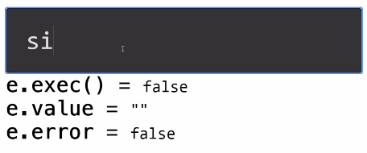

# cluster-ui


### cluster-ui-input



This component is made to support user mathematical expressions. It bases its compilation of the expressions on the library math.js.
<a href='http://mathjs.org'>http://mathjs.org</a>

The element has the tag "cluster-input" and that class is inherited from the constructor `Ui.Component`.
Example :

```HTML
<cluster-input type='number'></cluster-input>
```

OR

```Javascript
var input = new Cluster.Ui.Input('number');
// or
var input = document.createElement('cluster-input');

input.type = 'number';

```

It supports several attributes:
- `contenteditable` : disable or enable the component
- `type` : indicates the type of expected measure

List of types:


<table>
  <thead>
    <tr>
      <th>Base</th>
      <th>Unit</th>
    </tr>
  </thead>
  <tbody>
    <tr>
      <td>Length</td>
      <td>meter (m), inch (in), foot (ft), yard (yd), mile (mi), link (li), rod (rd), chain (ch), angstrom, mil</td>
    </tr>
    <tr>
      <td>Surface area</td>
      <td>m2, sqin, sqft, sqyd, sqmi, sqrd, sqch, sqmil, acre, hectare</td>
    </tr>
    <tr>
      <td>Volume</td>
      <td>m3, litre (l, L, lt, liter), cc, cuin, cuft, cuyd, teaspoon, tablespoon</td>
    </tr>
    <tr>
      <td>Liquid volume</td>
      <td>minim (min), fluiddram (fldr), fluidounce (floz), gill (gi), cup (cp), pint (pt), quart (qt), gallon (gal), beerbarrel (bbl), oilbarrel (obl), hogshead, drop (gtt)</td>
    </tr>
    <tr>
      <td>Angles</td>
      <td>rad (radian), deg (degree), grad (gradian), cycle, arcsec (arcsecond), arcmin (arcminute)</td>
    </tr>
    <tr>
      <td>Time</td>
      <td>second (s, secs, seconds), minute (mins, minutes), hour (h, hr, hrs, hours), day (days), week (weeks), month (months), year (years), decade (decades), century (centuries), millennium (millennia)</td>
    </tr>
    <tr>
      <td>Frequency</td>
      <td>hertz (Hz)</td>
    </tr>
    <tr>
      <td>Mass</td>
      <td>gram(g), tonne, ton, grain (gr), dram (dr), ounce (oz), poundmass (lbm, lb, lbs), hundredweight (cwt), stick, stone</td>
    </tr>
    <tr>
      <td>Electric current</td>
      <td>ampere (A)</td>
    </tr>
    <tr>
      <td>Temperature</td>
      <td>kelvin (K), celsius (degC), fahrenheit (degF), rankine (degR)</td>
    </tr>
    <tr>
      <td>Amount of substance</td>
      <td>mole (mol)</td>
    </tr>
    <tr>
      <td>Luminous intensity</td>
      <td>candela (cd)</td>
    </tr>
    <tr>
      <td>Force</td>
      <td>newton (N), dyne (dyn), poundforce (lbf), kip</td>
    </tr>
    <tr>
      <td>Energy</td>
      <td>joule (J), erg, Wh, BTU, electronvolt (eV)</td>
    </tr>
    <tr>
      <td>Power</td>
      <td>watt (W), hp</td>
    </tr>
    <tr>
      <td>Pressure</td>
      <td>Pa, psi, atm, torr, bar, mmHg, mmH2O, cmH2O</td>
    </tr>
    <tr>
      <td>Electricity and magnetism</td>
      <td>ampere (A), coulomb (C), watt (W), volt (V), ohm, farad (F), weber (Wb), tesla (T), henry (H), siemens (S), electronvolt (eV)</td>
    </tr>
    <tr>
      <td>Binary</td>
      <td>bit (b), byte (B)</td>
    </tr>
  </tbody>
</table>
